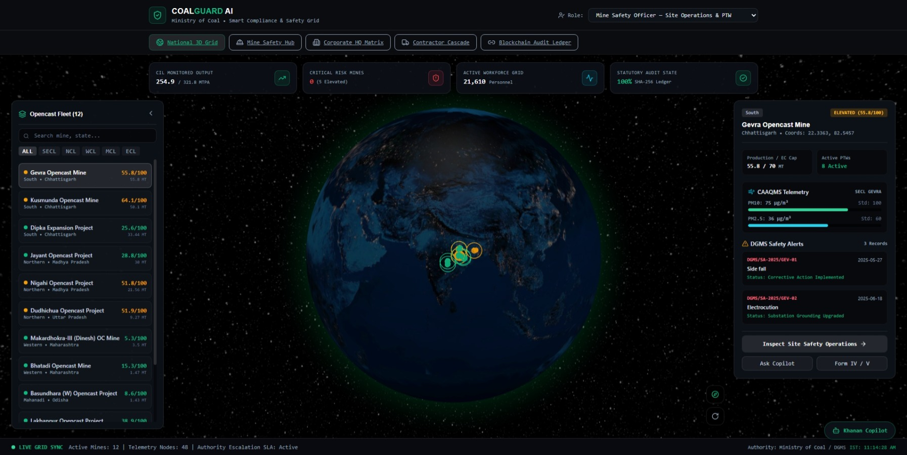
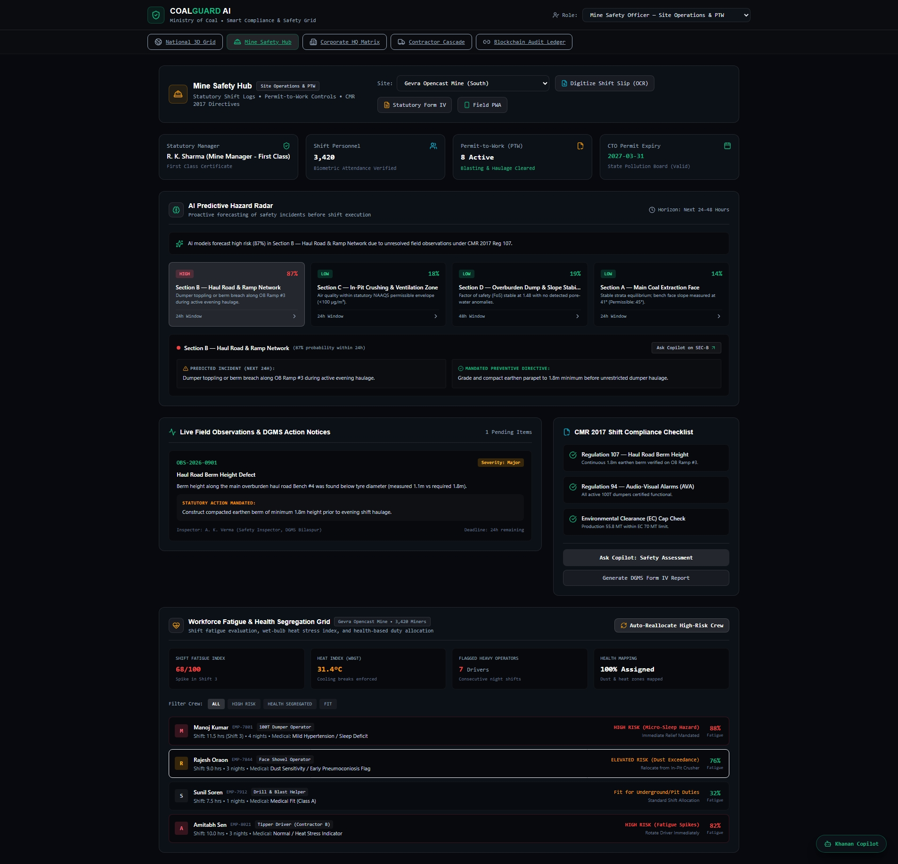
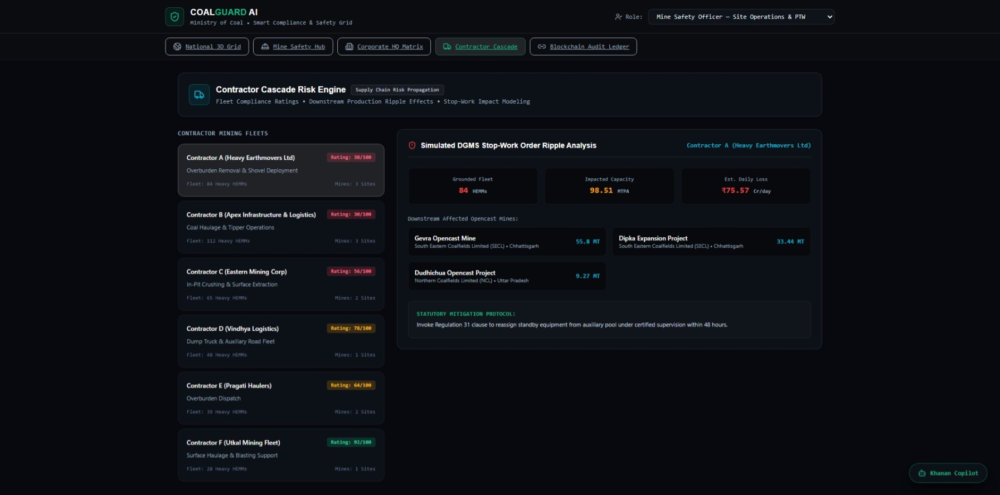
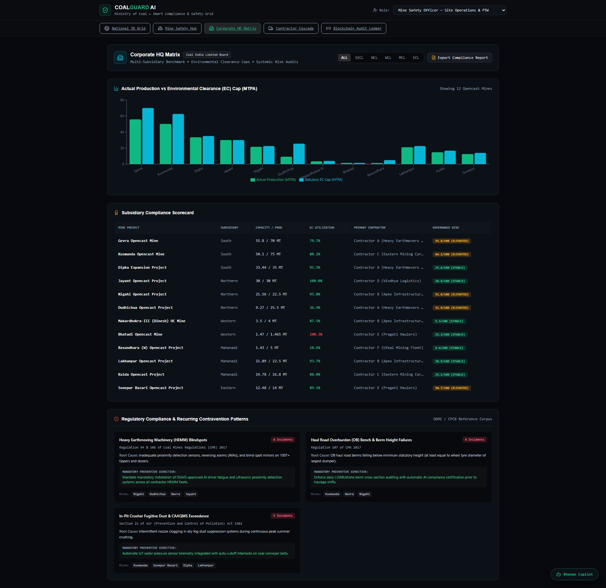
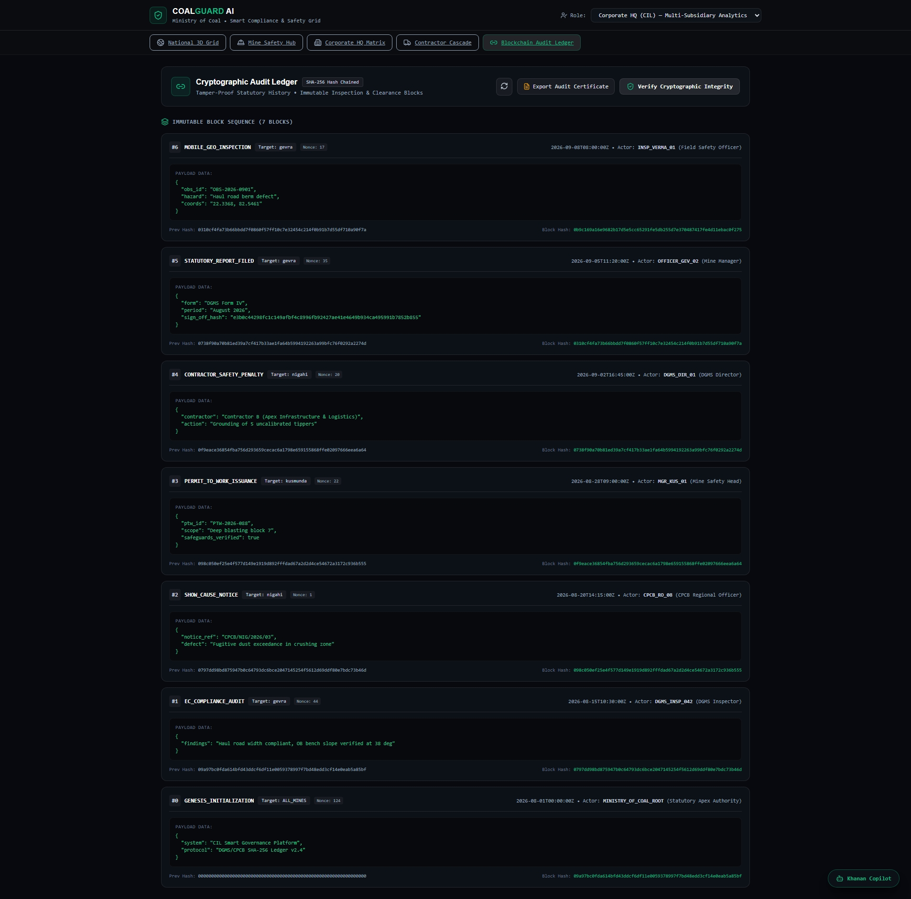
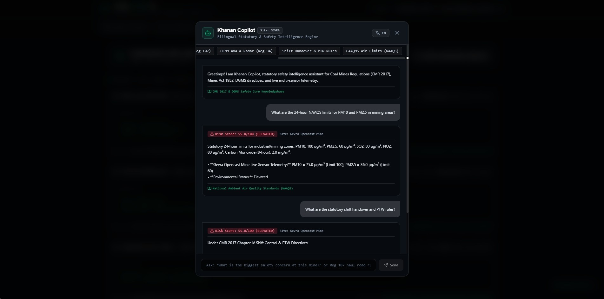

# CoalGuard AI — Smart Governance & Statutory Compliance Platform
### Ministry of Coal | Smart India Hackathon 2026
**Category:** Software | **Theme:** Smart Automation | **Problem ID:** SIH26024

---

## Executive Summary

**CoalGuard AI** is a centralized, AI-enabled smart governance and statutory compliance platform for the Indian coal mining ecosystem, built across Coal India Limited subsidiaries — **SECL, NCL, WCL, MCL, ECL**.

Its core differentiator is a **cross-mine contractor cascade engine**: when a contractor is flagged for a violation at one mine, the system automatically traces their assignment records and elevates risk at every other linked mine — closing a real accountability gap where flagged contractors currently operate undetected across subsidiary boundaries.

> **Data Notice:** CAAQMS air quality telemetry, DGMS safety contraventions, workforce fatigue models, and statutory inspection logs are curated reference datasets modeled directly on authentic Ministry of Coal, DGMS Dhanbad, and CPCB regulatory frameworks. This ensures deterministic, high-fidelity demonstrations during judging without dependency on external live network feeds.



---

## Key Modules

The application is organized into **5 primary navigation hubs**, plus an omnipresent AI assistant and integrated sub-features.

| # | Module | Route | What It Does |
|---|--------|-------|---------------|
| 1 | **National 3D Grid** | `/` | Interactive 3D globe (`react-globe.gl` + `Three.js`) mapping 12 CIL opencast mines with color-coded composite risk scores (Critical >=70, Elevated >=45, Stable <45) |
| 2 | **Mine Safety Hub** | `/mine-hub` | Site-level workbench — safety officer records, PTW tracking, AI Predictive Hazard Radar, workforce fatigue grid, live field observations |
| 3 | **Corporate HQ Matrix** | `/corporate` | Multi-subsidiary benchmarking, Production vs. EC Cap analytics, Subsidiary Compliance Scorecard, recurring DGMS/CPCB contravention patterns |
| 4 | **Contractor Cascade** | `/contractors` | Fleet & safety profiling, Stop-Work Ripple Simulator quantifying cascading economic impact across linked mines |
| 5 | **Blockchain Audit Ledger** | `/ledger` | SHA-256 hash-chained, tamper-evident audit trail with one-click integrity verification |



---

### 1. National 3D Grid (`/`)

- **Interactive Spatial Globe** — centers on India, renders all 12 mines as color-coded risk markers.
- **Dynamic Risk Categorization** — composite multi-signal scoring (environmental + safety + regulatory).
- **Real-Time Telemetry HUD** — production vs. EC cap, CAAQMS PM10/PM2.5 against NAAQS standards, recent DGMS alerts.

### 2. Mine Safety Hub (`/mine-hub`)

- **Site-Specific Workbench** — switch between all 12 mines; dynamically binds safety officer records, biometric attendance, active PTW counts.
- **AI Hazard Radar** — 24–48 hour forecasting horizon using rule-weighted heuristic scoring (observation severity, deadline proximity, environmental exceedance) — not a black-box ML model.
- **Shift Operations & Checklists** — live field observations with deadline tracking against CMR 2017 Reg 94 & 107.
- **Workforce Fatigue & WBGT Grid** — heat stress and fatigue indexing with one-click high-risk crew reallocation.



**Integrated Sub-Features:**

| Feature | Description |
|---------|--------------|
| **Statutory Document OCR** | Real Tesseract-based OCR pipeline — extracts text from uploaded scanned images/PDFs (CTO permits, EC orders, DGMS notices), then applies regex extraction for capacity caps and regulation citations. Requires Tesseract OCR binary installed on host (see Setup below). |
| **Statutory Form IV/V Generator** | One-click generation of DGMS Form IV (Notice of Accident) and CPCB Form V (Annual Environmental Statement), auto-populated from live mine data. |
| **Field Inspection Mobile PWA** (`/field-app`) | Offline-capable mobile inspection logger with GPS tagging and cryptographic submission to the audit ledger. |

### 3. Corporate HQ Matrix (`/corporate`)

- Multi-subsidiary benchmarking across SECL, NCL, WCL, MCL, ECL.
- Production vs. Environmental Clearance (EC) cap comparative analytics.
- Subsidiary Compliance Scorecard — production, contractor allocation, systemic risk ratings.
- Merged DGMS/CPCB recurring contravention pattern analysis.



### 4. Contractor Cascade (`/contractors`)

- Tracks contractor fleet size and statutory safety ratings.
- **Stop-Work Ripple Simulator** — quantifies cascading economic/operational impact of a simulated DGMS prohibitory order: grounded fleet size, impacted production capacity, and estimated daily revenue loss (in Crores INR/day) across every linked mine.

### 5. Blockchain Audit Ledger (`/ledger`)

- SHA-256 hash-chained audit trail — every risk-state transition, field inspection, and statutory filing is hashed and chained to the previous block.
- One-click cryptographic verification detects any unauthorized tampering across the full chain.



---

### Omnipresent Assistant: Khanan Copilot (खनन Copilot)

- Accessible from any view via the floating bottom-right trigger.
- **Bilingual** — reasons in English and Hindi.
- **Rule-based, not an LLM** — deterministic pattern-matching engine grounded in CMR 2017 (Reg 94 Audio-Visual Alarms, Reg 106 Bench Parameters, Reg 107 Berms), Mines Act 1952 (Section 22), and NAAQS thresholds, synthesized against live mine telemetry. No external LLM API call — fully local and auditable.



---

## Clean Folder Structure

```
coal/
├── backend/
│   ├── database.py              # SQLAlchemy ORM models & session management (SQLite)
│   ├── seed_db.py               # Auto-seeding script for 12 mines, contractors & telemetry
│   ├── coalguard.db             # Pre-seeded, persistent SQLite database
│   ├── data.py                  # Baseline reference dataset (12 CIL opencast mines)
│   ├── risk_engine.py           # Multi-signal composite risk algorithm
│   ├── cascade_engine.py        # Contractor cascade & stop-work ripple engine (relational lookup)
│   ├── blockchain_ledger.py     # SHA-256 cryptographic audit ledger
│   ├── ocr_digitizer.py         # Tesseract OCR + regex statutory document parser
│   ├── statutory_reports.py     # DGMS Form IV & CPCB Form V generator
│   ├── ai_copilot.py            # Bilingual Khanan Copilot (rule-based)
│   ├── prediction_engine.py     # 24-48h heuristic hazard forecasting engine
│   ├── authority_reporting.py   # Statutory notice filing & escalation engine
│   ├── main.py                  # FastAPI server with startup auto-seed handler
│   ├── test_suite.py            # Automated backend validation suite
│   └── requirements.txt         # fastapi, uvicorn, sqlalchemy, pydantic, pytesseract, Pillow, pypdf
│
├── docs/
│   └── screenshots/             # Architectural and UI demonstration screenshots
│
├── frontend/
│   ├── src/
│   │   ├── components/          # Topbar, NavigationTabs, GlobeVisualizer, AIPredictionCard,
│   │   │                        # WorkforceFatigueCard, KhananCopilotModal, OCRDocumentModal,
│   │   │                        # StatutoryReportModal
│   │   ├── pages/               # OverviewDashboard, MineOfficialView, CorporateExecutiveView,
│   │   │                        # ContractorSupplyChain, BlockchainAuditLedger, FieldInspectionApp
│   │   ├── lib/                 # api.js (REST client + offline fallback), sampleData.js
│   │   ├── App.jsx
│   │   ├── index.css
│   │   └── main.jsx
│   ├── package.json
│   ├── vite.config.js
│   └── index.html
│
├── start_all.bat                # 1-click launch (backend + frontend)
├── start_backend.bat
└── start_frontend.bat
```

---

## Quick Start

### Prerequisites
- Python 3.10+
- Node.js 18+ & npm
- **Tesseract OCR binary** (required for image OCR document digitizer — the rest of the app works without it):
  - **Windows:** [UB-Mannheim Tesseract installer](https://github.com/UB-Mannheim/tesseract/wiki) (Default: `C:\Program Files\Tesseract-OCR\tesseract.exe`)
  - **macOS:** `brew install tesseract`
  - **Linux:** `sudo apt install tesseract-ocr`

### 1-Click Launch (Windows)
Double-click `start_all.bat`. This launches:
- **Backend API:** `http://127.0.0.1:8000` (Swagger docs at `/docs`)
- **Frontend Dashboard:** `http://localhost:5173`

> `coalguard.db` ships pre-seeded with all 12 mines and baseline telemetry. If missing or empty, the backend auto-seeds on startup. To manually re-seed:
> ```bash
> python backend/seed_db.py
> ```

### Manual Launch

**Backend:**
```bash
pip install -r backend/requirements.txt
python -m uvicorn backend.main:app --host 127.0.0.1 --port 8000 --reload
```

**Frontend:**
```bash
cd frontend
npm install
npm run dev
```

---

## Verification & Test Suites

```bash
# Backend test suite
python -m backend.test_suite

# Frontend lint + build
cd frontend
npm run lint
npm run build
```

---

## Prototype Demo Video

- **Video Walkthrough:** [CoalGuard AI - 90 Second Video Demonstration](https://youtu.be/placeholder)

---

## Team & Attribution

- **Team:** Embers
- **Team ID:** 168719
- **Event:** Smart India Hackathon (SIH 2026)
- **Problem Statement ID:** SIH26024 (Ministry of Coal)
